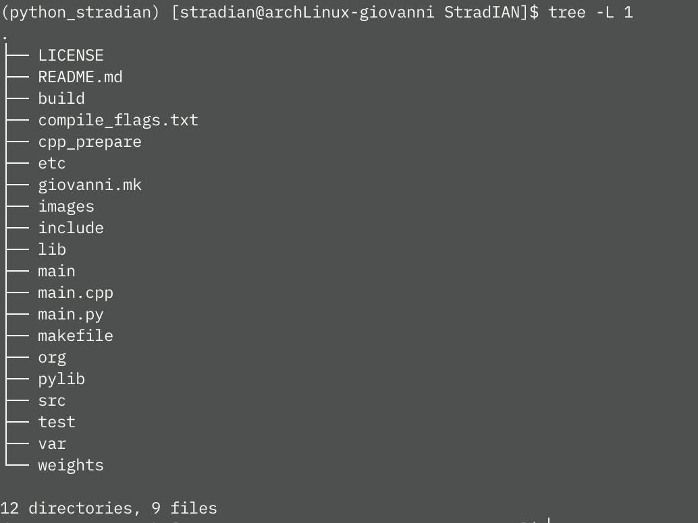

<!-- 
	***
	*   README.md
	*	
	*	Author: Jeong Hoon (Sian) Choi
	*	License: MIT
	*	
	***
-->
<a name="readme-top"></a>

<br/>
<div align="center">
	<a href="https://github.com/csian98/stradian">
		
	</a>
	<h3 align="center">StradIAN</h3>	
	<a href="mailto:csian7386@gmail.com"></a>
	<a href="https://instagram/csian98"></a>
	<a href="https://discord.gg/YhghyDBgKa"></a>
	<a href="https://csian98.github.io"></a>
	<a href="https://www.linkedin.com/in/csian98/"></a>
	<p align="center">
	StradIAN is a data model-based Robo-Advisor production project personally created by the author.
	<br/>
	<br/>
	<a href="https://github.com/csian98/stradian">
		<strong>Explore the docs »</strong>
	</a>
	<br/>
	<br/>
	<a href="https://github.com/csian98/stradian/issues/new?labels=bug&template=bug-report---.md">Report Bug</a>
	·
	<a href="https://github.com/csian98/stradian/issues/new?labels=enhancement&template=feature-request---.md">Request Feature</a>
	</p>
</div>

<details>
	<summary>Table of Contents</summary>
	<ol>
		<li>
			<a href="#about-the-project">About The Project</a>
			<ul>
				<li><a href="#development-environment">Development Environment</a>
			</ul>
			<ul>
				<li><a href="#built-with">Built With</a></li>
			</ul>
			<ul>
				<li><a href="#data-source">Data Source</a></li>
			</ul>
		</li>
		<li>
			<a href="#getting-started">Getting Started</a>
			<ul>
				<li>
					<a href="#prerequisites">Prerequistes</a>
				</li>
				<li>
					<a href="#installation">Installation</a>
				</li>
			</ul>
		</li>
		<li>
			<a href="#usage">Usage</a>
		</li>
		<li>
			<a href="#roadmap">Roadmap</a>
		</li>
		<li>
			<a href="#license">License</a>
		</li>
		<li>
			<a href="#contact">Contact</a>
		</li>
  </ol>
</details>

## About The Project

![Language][language-shield]
![repo size][repo-size-shield]
![weekly commits][commit-activity-shield]
![last commit][last-commit-shield]
[![MIT License][license-shield]][license-url]

<p align="center">
	
</p>

StradIAN is a financial robo-advisor project based on data learning.
The project, which started in mid-2024, is a personal project, and the author has the authority over its development.
No data other than data shared on git hub is shared.
The author is not an expert in the financial market, and the investor is responsible for all investments.

### Development Environment
* [![Arch Linux][archlinux-shield]][archlinux-url]
* [![CUDA][cuda-shield]][cuda-url]

### Built With
* [![C++][cpp-shield]][cpp-url]
* [![Python][python-shield]][python-url]
* [![TensorFlow][tensorflow-shield]][tensorflow-url]
* [![openSSL][openssl-shield]][openssl-url]
* [![curl][curl-shield]][curl-url]
* [![mariaDB][mariadb-shield]][mariadb-url]
* [![mongoDB][mongodb-shield]][mongodb-url]


### Data Source
* [![Yahoo! Finance][yahoo-shield]][yahoo-url]
* [![Binance][binance-shield]][binance-url]

<p align="right">(<a href="#readme-top">back to top</a>)</p>

## ⚓ Getting Started
StradIAN

The MariaDB database username and password must be stored in <u>etc/dbms/mariadb_user<u/> and <u>etc/dbms/mariadb_passwd<u/>, respectively.

ChatDB (For DSCI551)
### Prerequisites

The ChatDB server uses SSL-based TCP communication by default.
It requires the <u>etc/c2c/stradian.key<u/> and <u>etc/c2c/stradian.crt<u/> certificates for both the server and the client.

An example of certificate generation using OpenSSL is shown below.
```sh
openssl req -x509 -nodes -days 365 -newkey rsa:2048 -keyout stradian.key -out stradian.crt
```

Additionally, all crawlers use Selenium, which requires ChromeDriver.
For more information about ChromeDriver, refer [here](https://developer.chrome.com/docs/chromedriver).

<p align="right">(<a href="#readme-top">back to top</a>)</p>

## 📌 Usage

ChatDB (For DSCI551)
The _*.py_ code files in _pylib/stradian_ contains the source code toe use.
Every execute codes are located under _pylib/exec_ with _*.py_ extension.

Running Server and Client for the ChatDB
```sh
python3 pylib/exec/chatdb_server_main.py &
python3 pylib/exec/chatdb_client_main.py
```

The data (symobls) stored in the database are limited to symbols with <u>trade=1<u/> in the <u>system.<market_type>_market<u/> table.
After modifying this, you can run the crawler using the code below.
```sh
python3 pylib/exec/crypto_crawler_main.py
python3 pylib/exec/currency_crawler_main.py
python3 pylib/exec/indices_crawler_main.py

```

Currently, the natural language parsing task in ChatDB is based on the existing descriptions and the <u>etc/query/query_explain.json<u/> file.
After adding or modifying the file's descriptions, you can use the code below to store them in the hash table.
```sh
python3 pylib/exec/random_hash.py
```

<p align="right">(<a href="#readme-top">back to top</a>)</p>

## Roadmap

- [ ] Exchange
	- [X] Binance Exchange
	- [ ] Fidetlity Exchange
- [ ] General Data Crawler
	- [X] Crypto Market (Binanace)
	- [X] Currency Market (Yahoo)
	- [X] Indices Market (Yahoo)
	- [ ] Stock Market (Yahoo)
- [ ] Models
    - [ ] Trading
    - [ ] Rebalancing
- [ ] System
	- [X] Slack & Email notificator
	- [ ] User management
	- [ ] C2C Server
- [ ] User Interface
    - [X] ChatDB (USC DSCI 551 Project)
	- [ ] Meta-Llama (NLP interface: Kyra)

See the [open issues](https://github.com/csian98/StradIAN/issues) for a full list of proposed features (and known issues).

<p align="right">(<a href="#readme-top">back to top</a>)</p>

## License

Distributed under the MIT License. See `LICENSE` for more information.

<p align="right">(<a href="#readme-top">back to top</a>)</p>

## Contact

Jeong Hoon (Sian) Choi - [@csian98](https://instagram.com/csian98) - [csian7386@gmail.com](mailto:csian7386@gmail.com)

Project Link: [https://github.com/csian98/StradIAN](https://github.com/csian98/StradIAN)

<p align="right">(<a href="#readme-top">back to top</a>)</p>

[language-shield]: https://img.shields.io/github/languages/top/csian98/StradIAN.svg?style=for-the-badge
[code-size-shield]: https://img.shields.io/github/languages/code-size/csian98/StradIAN.svg?style=for-the-badge
[repo-size-shield]: https://img.shields.io/github/repo-size/csian98/StradIAN.svg?style=for-the-badge
[commit-activity-shield]: https://img.shields.io/github/commit-activity/w/csian98/StradIAN.svg?style=for-the-badge
[last-commit-shield]: https://img.shields.io/github/last-commit/csian98/StradIAN.svg?style=for-the-badge
[license-shield]: https://img.shields.io/github/license/csian98/StradIAN.svg?style=for-the-badge
[license-url]: https://github.com/csian98/sian/blob/main/LICENSE

[macos-shield]: https://img.shields.io/badge/mac%20os-000000?style=for-the-badge&logo=macos&logoColor=F0F0F0
[macos-url]: https://developer.apple.com/macos
[archlinux-shield]: https://img.shields.io/badge/Arch%20Linux-1793D1?logo=arch-linux&logoColor=fff&style=for-the-badge
[archlinux-url]: https://archlinux.org
[cuda-shield]: https://img.shields.io/badge/NVIDIA%20CUDA-RTX3060-76B900?style=for-the-badge&logo=nvidia&logoColor=white
[cuda-url]: https://docs.nvidia.com/cuda/cuda-c-programming-guide/

[sqlite-shield]: https://img.shields.io/badge/sqlite-%2307405e.svg?style=for-the-badge&logo=sqlite&logoColor=white
[mariadb-shield]: https://img.shields.io/badge/MariaDB-003545?style=for-the-badge&logo=mariadb&logoColor=white
[mariadb-url]: https://mariadb.com/docs/server/connect/
[mongodb-shield]: https://img.shields.io/badge/MongoDB-%234ea94b.svg?style=for-the-badge&logo=mongodb&logoColor=white
[mongodb-url]: https://www.mongodb.com
[slack-shield]: https://img.shields.io/badge/Slack%20API-4A154B?style=for-the-badge&logo=slack&logoColor=white
[slack-url]: https://api.slack.com
[openai-shield]: https://img.shields.io/badge/openAI%20API-74aa9c?style=for-the-badge&logo=openai&logoColor=white
[openai-url]: https://platform.openai.com/docs/api-reference

[openssl-shield]: https://img.shields.io/badge/OpenSSL-721412?style=for-the-badge&logo=OpenSSL
[openssl-url]: https://www.openssl.org
[curl-shield]: https://img.shields.io/badge/curl-073551?style=for-the-badge&logo=curl
[curl-url]: https://curl.se

[hadoop-shield]: https://img.shields.io/badge/Apache%20Hadoop-66CCFF?style=for-the-badge&logo=apachehadoop&logoColor=black
[tensorflow-shield]: https://img.shields.io/badge/TensorFlow-%23FF6F00.svg?style=for-the-badge&logo=TensorFlow&logoColor=white
[tensorflow-url]: https://www.tensorflow.org

[c-shield]: https://img.shields.io/badge/C-00599C?style=for-the-badge&logo=c&logoColor=white
[cpp-shield]: https://img.shields.io/badge/C%2B%2B-00599C?style=for-the-badge&logo=c%2B%2B&logoColor=white
[cpp-url]: https://cplusplus.com
[python-shield]: https://img.shields.io/badge/Python-FFD43B?style=for-the-badge&logo=python&logoColor=blue
[python-url]: https://www.python.org
[elisp-shield]: https://img.shields.io/badge/Emacs%20Lisp-%237F5AB6.svg?&style=for-the-badge&logo=gnu-emacs&logoColor=white
[r-shield]: https://img.shields.io/badge/R-276DC3?style=for-the-badge&logo=r&logoColor=white
[shell-shield]: https://img.shields.io/badge/Shell_Script-121011?style=for-the-badge&logo=gnu-bash&logoColor=white

[keras-shield]: https://img.shields.io/badge/Keras-%23D00000.svg?style=for-the-badge&logo=Keras&logoColor=white
[pytorch-shield]: https://img.shields.io/badge/PyTorch-%23EE4C2C.svg?style=for-the-badge&logo=PyTorch&logoColor=white

[binance-shield]: https://img.shields.io/badge/Binance-FCD535?style=for-the-badge&logo=binance&logoColor=white
[binance-url]: https://developers.binance.com/docs/binance-spot-api-docs/web-socket-api
[yahoo-shield]: https://img.shields.io/badge/Yahoo!-6001D2?style=for-the-badge&logo=Yahoo!&logoColor=white
[yahoo-url]: https://finance.yahoo.com
